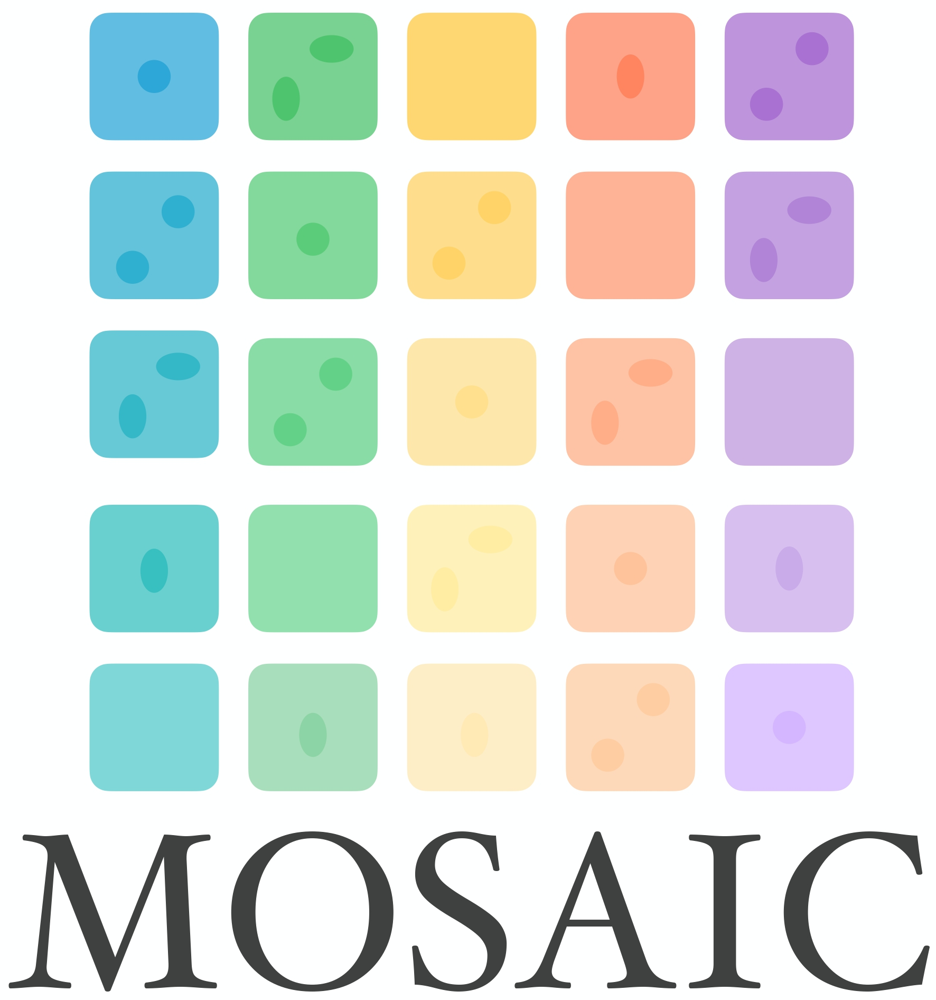
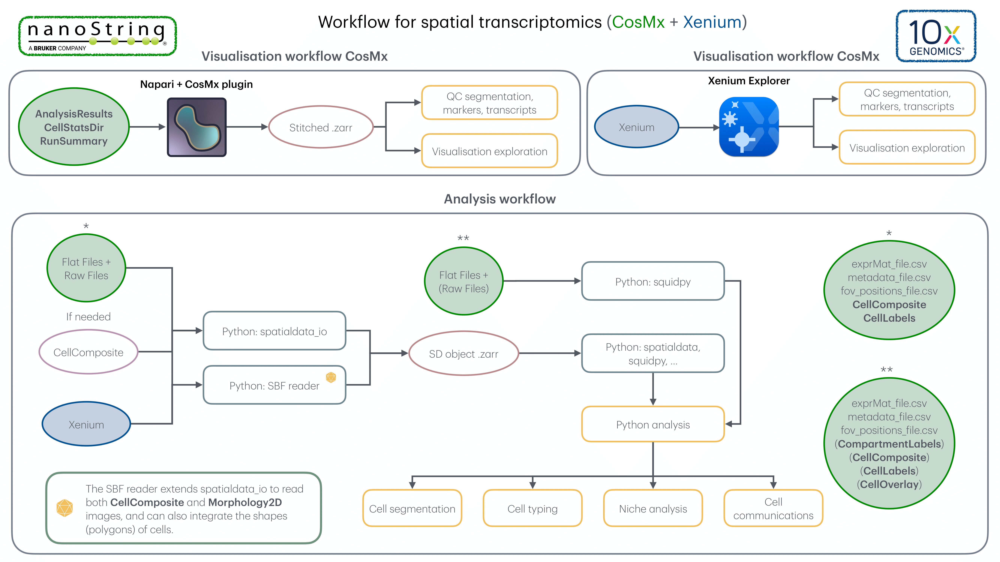
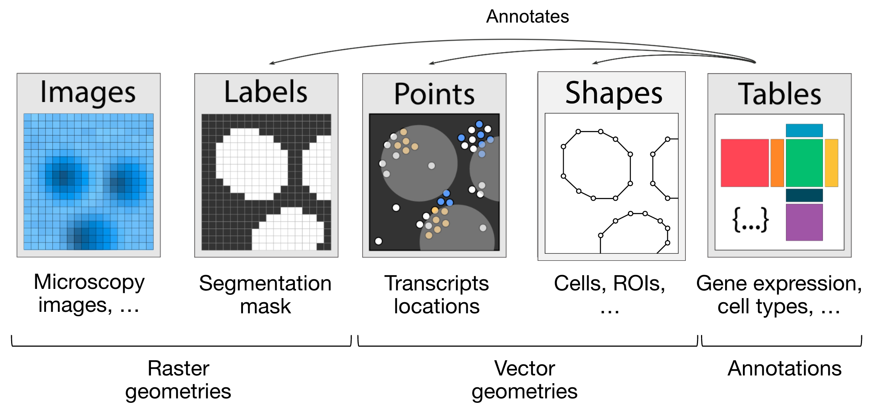

<p align="left">
  
  &nbsp;&nbsp;&nbsp;&nbsp;&nbsp;&nbsp;&nbsp;&nbsp;&nbsp;&nbsp;&nbsp;&nbsp;&nbsp;&nbsp;&nbsp;&nbsp;
  
</p>

# Spatial Biology Facility at King's College London

At King's College London, the [Spatial Biology Facility](https://www.kcl.ac.uk/research/facilities/the-spatial-biology-facility) utilises both CosMx and Xenium technologies.

## 📝 Introduction  
<p align="center">
  
</p>

At the Spatial Biology Facility, we have developed **MOSAIC** (Multi-Origin Spatial Transcriptomics Analysis and Integration Core) to fully leverage the power of spatial biology and enable seamless multimodal integration. MOSAIC is a dynamic, evolving workflow designed to adapt to the latest versions of key platform providers, including 10X Genomics and NanoString, while staying aligned with emerging trends in the spatial biology community. In the following section, we will walk you through the process of using MOSAIC for data integration and analysis

### Numerical materials include in MOSAIC

- [Napari v0.4.17](https://github.com/napari/napari/releases/tag/v0.4.17) + CosMx plugin (`napari/napari_CosMx-0.4.17.3-py3-none-any.whl`)
- CosMx/Xenium conda environment (`env/cosmx.yml`)
- CosMx folder formating and composition images codes (`tools`)
- Xenium explanation folder (`tools/Xenium_data.xlsx`)
- CosMx/Xenium Reader (`src/reader/`)
- CosMx/Xenium QC scripts (`src/qc/`)
- CosMx/Xenium resegmentation scripts (`src/segmentation/`)
- CosMx/Xenium analysis codes (`src/analysis/`)

### MOSAIC workflow



## 📋 Integrating the data step by step 

### CosMx

1. Export the data from the AtoMx platform. The export should include all `flatFiles` and the following `RawFiles`  
   - `Morphology2D`  
   - `Misc`  
   *(In AtoMx v1.4, this includes all RawFiles. In earlier versions, it includes all RawFiles **except** the `Spot files`.)*

2. Unzip all `.csv.gz` files in the flatFiles folder. In a terminal, if your working directory is `flatFiles`, run:

   ```bash
   gunzip *.csv.gz
   
3. Now, the raw images should be included in the flatFiles folder. To do this, you can use the bash script `CellLabels.sh` available in the `tools/` folder of the GitHub repository.

4. Firstly, you have to change the `SOURCE_DIR` and the `DEST_DIR` variables in the script to match your own directories.

5. Secondly, make the script executable and run it using the following commands:

   ```bash
   chmod +x CellLabels.sh
   ./CellLabels.sh
   ```

6. This will create a `CellLabels` folder inside the flatFiles folder.

7. The last folder to include is the `CellComposite` folder from `Morphology2D`. Depending on your choice:
   - If you opt for a composite `.jpg` image (`CellComposite`)
   - Or for raw multichannel `.TIF` images (approximately 200 times larger than composite images)

   Both folders are located in the `RawFiles` directory, under the subfolder named `CellStatsDir`.

8. If the `CellComposite` folder is not present or is unsatisfactory, a new one can be created using the Python script by specifying the folder that contains the TIF images.:

   ```bash
   python tools/make_composite_revised_image.py
   ```

9. When the `flatFiles` folder is ready, i.e., enriched with the `CellComposite`/`Morphology2D` folder and the `CellLabels` folder, you can either import and create the `.zarr` object with the Python code `src/qc/CosMx_QC.py`.
10. Create the Napari visualisation (see the section **How to use Napari**).
11. The Napari visualization can be used to proceed with the QC using the same code as the one used for the `.zarr` object creation (`src/qc/CosMx_QC.py`), especially for defining the different sample FOVs.

### Xenium

1. Export the data from the Xenium instrument, the folder contains a lot of files that are described in `tools/Xenium_data.xlsx` file of the GitHub repository.
2. Exploring the data with [Xenium Explorer](https://www.10xgenomics.com/products/xenium-analysis)
3. You can import and create the `.zarr` object with the Python code `src/qc/Xenium_QC.py`
4. When the `.zarr` object is created, you can proceed with the QC using the same code as before (`src/qc/Xenium_QC.py`).

## 🔬 How to use Napari 

1. Install Napari 0.4.17.
2. Launch Napari and open the IPython console (symbol "**>_**").
3. Install the CosMx plugin:

    ```bash
    pip install napari_CosMx-0.4.17.3-py3-none-any.whl
    ```

4. Drag the `napari_cosmx_launcher` folder into the Napari window. You can download it from [this link](https://emckclac-my.sharepoint.com/:f:/g/personal/k2481276_kcl_ac_uk/EkO8xJFpX8ZBv_lq-5zRHQQBjcoTOE8PONclhqUfj20zSw?e=WtIiKX)
5. In the right panel, select the parent folder that contains your CosMx run.
6. Choose the output folder.
7. Click the "**Stitch**" button.
8. Wait for the stitching to finish (the only indicator is the loading cursor).
9. After stitching, the output directory will contain:
   - an `images` folder with all FOVs
   - a `targets.hdf5` file with the transcripts
10. Restart Napari 0.4.17 and drag the project folder into the window.

11. Once loaded, use the panels to explore:

    - **Morphology Images**: Add fluorescent channels.
    - **RNA Transcripts**: Add transcripts.
    - **Layer list**: Manage transcripts, channels, and segmentation.
    - **Layer controls**: Adjust visualisation.

## 🗺️ SpatialData object overview 

The **SpatialData** object forms the foundation for analysing spatial omics data.

### Core concepts

A SpatialData object is a container for **Elements**, either:

- **SpatialElements**:
    - **Images**: e.g. H&E stains.
    - **Labels**: Segmentation maps.
    - **Points**: Transcripts or landmarks.
    - **Shapes**: Cell/nucleus boundaries or ROIs.
- **Tables**: Annotate spatial elements or store metadata (non-spatial).

### Categories

- **Rasters**: Pixel-based data (Images, Labels)
- **Vectors**: Geometry-based data (Points, Shapes)

### Transformations

- **Vectorisation**: Converts Labels → Shapes (`shapely` polygons)
- **Rasterisation**: Converts Shapes/Points → Labels (2D image representation)

You can explore a SpatialData object visually using the **spatialdata-napari** plugin.

For tutorials, see the [spatialdata-napari documentation](https://spatialdata.scverse.org/projects/napari/en/latest/notebooks/spatialdata.html).




## Downstream analysis

* [scverse](https://scverse.org/packages/#ecosystem)
* [xb best practices](https://github.com/Moldia/Xenium_benchmarking)

### Segmentation

* [sopa](https://gustaveroussy.github.io/sopa/)

### Cell typing

* [cellTypist](https://www.celltypist.org)
* [TANGRAM](https://tangram-sc.readthedocs.io/en/latest/)
* [cell2location](https://cell2location.readthedocs.io/en/latest/)

### Domaine identification

* [STAGATE](https://stagate.readthedocs.io/en/latest/index.html)
* [SpaGCN](https://github.com/jianhuupenn/SpaGCN)
* [Banksy](https://github.com/prabhakarlab/Banksy_py)

### Genes imputation

* [TANGRAM](https://tangram-sc.readthedocs.io/en/latest/)
* [SpaOTsc](https://github.com/zcang/SpaOTsc)
* [SpaGE](https://github.com/tabdelaal/SpaGE)
* [novoSpaRc](https://github.com/rajewsky-lab/novosparc)

### Spatially variable genes

* [SpatialDE](https://github.com/Teichlab/SpatialDE)
* [SINFONIA](https://github.com/BioX-NKU/SINFONIA)

### Cell-cell communications

* [DeepTalk](https://github.com/JiangBioLab/DeepTalk)
* [NicheCompass](https://nichecompass.readthedocs.io/en/latest/)
* [COMMOT](https://github.com/zcang/COMMOT)
* [CellphoneDB](https://github.com/ventolab/CellphoneDB)
* [NCEM](https://github.com/theislab/ncem)
* [FlowSig](https://github.com/axelalmet/flowsig)

### Other tools

* [SpaGFT](https://github.com/OSU-BMBL/SpaGFT)

## 📫 Contact

For any questions, reach out to **Anthony Baptista**: 📧 [anthony.baptista@kcl.ac.uk](mailto:anthony.baptista@kcl.ac.uk)

## ♻️ License

This work is licensed under:

- **MIT license** (for code)
- **Creative Commons Attribution 4.0 International license** (for docs)

You may share/adapt for any purpose, including commercially, with proper credit and no added restrictions.

## ✨ Contributors

|   |
|------------------------------------------------------------------------------------------|
| Anthony Baptista                                                                         |
