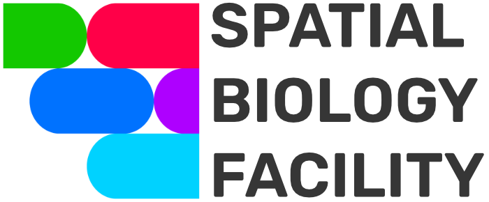

# Spatial Biology Facility at King's College London

| {width=125} | {width=210} |
|--------------------------------------------|---------------------------------------------|

## Introduction

At King's College London, the [Spatial Biology Facility](https://www.kcl.ac.uk/research/facilities/the-spatial-biology-facility) utilizes both CosMx and Xenium technologies. The data is then integrated into a Python workflow, allowing us to fully leverage spatial biology and facilitate multimodal integration.

## 🎯 Roadmap

### Numerical materials

- [Napari v0.4.17](https://github.com/napari/napari/releases/tag/v0.4.17) + CosMx plugin (`napari/napari_CosMx-0.4.17.3-py3-none-any.whl`)
- CosMx/Xenium conda environment (`env/cosmx.yml`)
- CosMx/Xenium Reader (`src/reader/`)
- CosMx/Xenium QC scripts (`src/qc/`)
- CosMx/Xenium resegmentation scripts (`src/segmentation/`)
- CosMx Cell composition code (`src/composition/`)
- CosMx/Xenium analysis codes (`src/analysis/`)

### Integration workflow


## How to use Napari

1. Install Napari 0.4.17.
2. Launch Napari and open the IPython console (symbol "**>_**").
3. Install the CosMx plugin:

    ```bash
    pip install napari_CosMx-0.4.17.3-py3-none-any.whl
    ```

4. Drag the `napari_cosmx_launcher` folder into the Napari window. You can download it from [this link](https://emckclac-my.sharepoint.com/:f:/g/personal/k2481276_kcl_ac_uk/EkO8xJFpX8ZBv_lq-5zRHQQBjcoTOE8PONclhqUfj20zSw?e=WtIiKX)
5. In the right panel, select the parent folder that contains your CosMx run.
6. Choose the output folder.
7. Click the "**Stitch**" button.
8. Wait for the stitching to finish (the only indicator is the loading cursor).
9. After stitching, the output directory will contain:
   - an `images` folder with all FOVs
   - a `targets.hdf5` file with the transcripts
10. Restart Napari 0.4.17 and drag the project folder into the window.

11. Once loaded, use the panels to explore:

    - **Morphology Images**: Add fluorescent channels.
    - **RNA Transcripts**: Add transcripts.
    - **Layer list**: Manage transcripts, channels, and segmentation.
    - **Layer controls**: Adjust visualization.

## SpatialData object overview

The **SpatialData** object forms the foundation for analyzing spatial omics data.

### Core concepts

A SpatialData object is a container for **Elements**, either:

- **SpatialElements**:
    - **Images**: e.g. H&E stains.
    - **Labels**: Segmentation maps.
    - **Points**: Transcripts or landmarks.
    - **Shapes**: Cell/nucleus boundaries or ROIs.
- **Tables**: Annotate spatial elements or store metadata (non-spatial).

### Categories

- **Rasters**: Pixel-based data (Images, Labels)
- **Vectors**: Geometry-based data (Points, Shapes)

### Transformations

- **Vectorization**: Converts Labels → Shapes (`shapely` polygons)
- **Rasterization**: Converts Shapes/Points → Labels (2D image representation)

You can explore a SpatialData object visually using the **spatialdata-napari** plugin.

For tutorials, see the [spatialdata-napari documentation](https://spatialdata.scverse.org/projects/napari/en/latest/notebooks/spatialdata.html).


## 📫 Contact

For any questions, reach out to **Anthony Baptista**:  
📧 [anthony.baptista@kcl.ac.uk](mailto:anthony.baptista@kcl.ac.uk)

## ♻️ License

This work is licensed under:

- **MIT license** (for code)
- **Creative Commons Attribution 4.0 International license** (for docs)

You may share/adapt for any purpose, including commercially, with proper credit and no added restrictions.

## ✨ Contributors

| {width=100} |
|----------------------------------------------------------------------------------------------|
| **Anthony Baptista**                                                                         |
