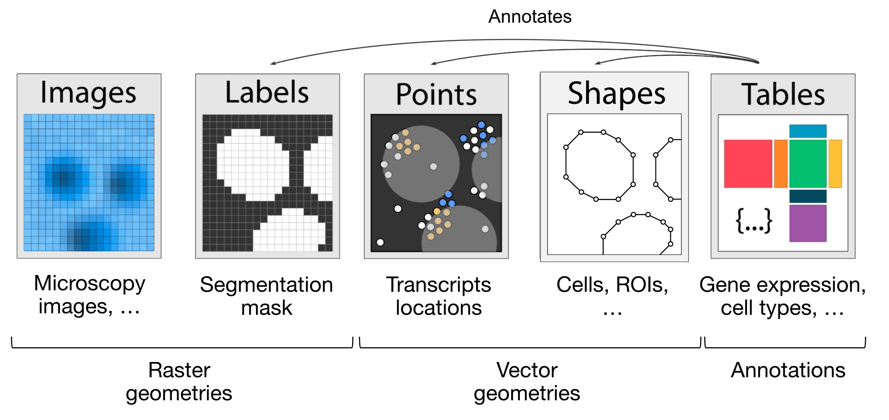

=============================================================================================
Spatial Biology Facility at King's College London
=============================================================================================
+--------------------------------------+--------------------------------------+
| .. image:: images/kcl_logo.png       |       .. image:: images/sbf_logo.png |
|    :width: 125px                     |          :width: 210px               |
+--------------------------------------+--------------------------------------+

Introduction:
===============
In King's College London at the `Spatial Biology Facility <https://www.kcl.ac.uk/research/facilities/the-spatial-biology-facility>`_, we utilise both CosMx and Xenium technologies. The data is then integrated into a Python workflow, allowing us to fully leverage the spatial biology aspects and facilitate multimodal integration.

🎯 Roadmap
====

Numerical materials:
--------------------
* `Napari v0.4.17 <https://github.com/napari/napari/releases/tag/v0.4.17>`_ + CosMx plugin (**napari/napari_CosMx-0.4.17.3-py3-none-any.whl**)
* CosMx/Xenium conda environment (**env/cosmx.yml**)
* CosMx/Xenium Reader (**src/reader/**)
* CosMx/Xenium QC scripts (**src/qc/**)
* CosMx/Xenium resegmentation scripts (**src/segmentation/**)
* CosMx Cell composition code (**src/composition/**)
* CosMx/Xenium analysis codes (**src/analysis/**)

Integration workflow:
--------------------

.. image:: images/sbf_workflow.png    

How using Napari:
--------------------

1. Install Napari 0.4.17.
2. Launch Napari and open the IPython console window (indicated by the symbol "**>_**").
3. Install the CosMx-plugin with the following command:

.. code-block:: python

    pip install napari_CosMx-0.4.17.3-py3-none-any.whl

4. Drag the napari_cosmx_launcher folder into the Napari window. You can download the folder from this `link <https://emckclac-my.sharepoint.com/:f:/g/personal/k2481276_kcl_ac_uk/EkO8xJFpX8ZBv_lq-5zRHQQBjcoTOE8PONclhqUfj20zSw?e=WtIiKX>`_
5. In the right panel, browse to and select the parent folder that contains your CosMx run.
6. Choose the output folder.
7. Launch the stitching by pressing the "**Stitch**" button.
8. Wait until the stitching process finishes. There is no indicator that shows the stitching is running, except for the loading cursor. Therefore, avoid clicking the "**Stitch**" button multiple times. Once the stitching is complete, a message will appear in the right panel.
9. When the stitching is finished, the output directory contains an "**images**" folder with all the FOVs across different fluorescent channels, and a "**targets.hdf5**" file that stores the transcripts.
10. To load your Napari project, restart Napari 0.4.17 and drag the project folder, which contains both the "**images**" folder and the "**targets.hdf5**" file into the Napari window.

11. When the project folder is loaded, several panels allow the user to visualize the different information from the CosMx run:

    * **Morphology Images** panel allows adding fluorescent channels (panel on the right).
    * **RNA Transcripts** panel allows adding transcripts (panel on the right).
    * **Layer list** allows controlling the different objects, including transcripts, fluorescent channels, and segmentation (panel on the left).
    * **Layer controls** panel allows adjusting the visualization of the different objects (panel on the left).

SpatialData object overview:
------------------------------

The purpose of the **SpatialData** object is to lay the foundation for methods and pipelines to analyse spatial omics data.

We can think of a **SpatialData object** as a container for various **Elements**. An **Element** is either a **SpatialElement** (Images, Labels, Points, Shapes) or a **Table**.

Below is a brief description of each:

- **Images**: H&E or other staining images.
- **Labels**: Pixel-level segmentation maps.
- **Points**: Transcript locations with gene information, or landmark points.
- **Shapes**: Cell or nucleus boundaries, subcellular structures, anatomical annotations, or regions of interest (ROIs).
- **Tables**: Sparse or dense matrices annotating SpatialElements or storing arbitrary (non-spatial) metadata. They do not contain spatial coordinates.

We can categorise the **SpatialElements** into two broad types:

- **Rasters**: Data made up of pixels, including Images and Labels.
- **Vectors**: Data made up of points and lines. (Polygons are considered vectors, as they are simply a list of connected points.) Points and Shapes belong to this category.

However we can go from one type of object into another by the two following processes:

- **Vectorization**: The process where each label value (i.e., an integer value greater than 0) is converted into a `shapely` Polygon or MultiPolygon. This corresponds to the conversion of Labels into Shapes.
- **Rasterization**: The creation of a 2D image that represents geometries (polygons, multipolygons, points). This corresponds to the conversion of Shapes (or Points) into Labels.

Finally, it is possible to visually interact with a **SpatialData** object, through the **spatialdata-napari** plugin.

For more information and tutorials, see:  
`spatialdata-napari documentation <https://spatialdata.scverse.org/projects/napari/en/latest/notebooks/spatialdata.html>`_

📫 Contact
====

For any questions, you can directly reach out to Anthony Baptista by emailing `anthony.baptista@kcl.ac.uk <mailto:anthony.baptista@kcl.ac.uk>`_.

♻️ License
====

This work is licensed under the MIT license (code) and Creative Commons Attribution 4.0 International license (for documentation).
You are free to share and adapt the material for any purpose, even commercially,
as long as you provide attribution (give appropriate credit, provide a link to the license,
and indicate if changes were made) in any reasonable manner, but not in any way that suggests the
licensor endorses you or your use and with no additional restrictions.

Contributors ✨:
===============
+---------------------------------------------------------------------------+
| .. image:: https://api.dicebear.com/9.x/rings/svg?seed=Anthony%20Baptista |
|    :width: 100px                                                          |
|                                                                           |
| **Anthony Baptista**                                                      |
+---------------------------------------------------------------------------+

