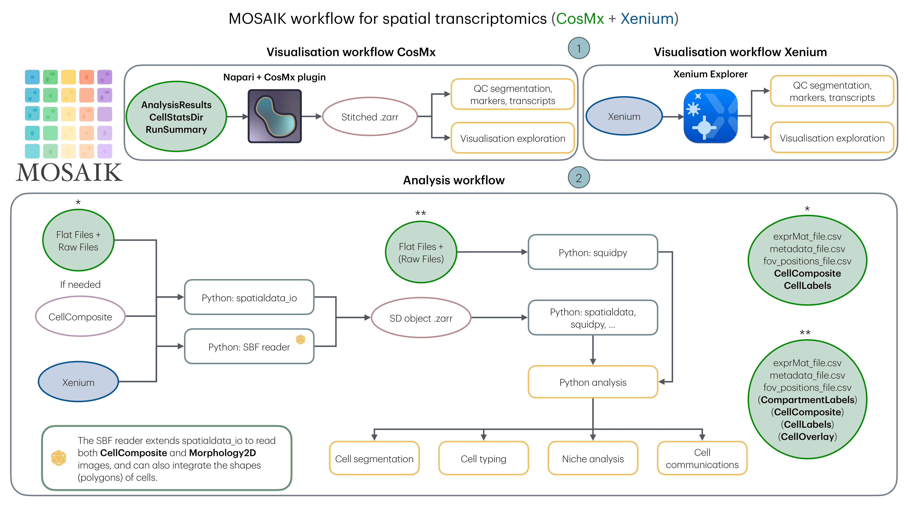
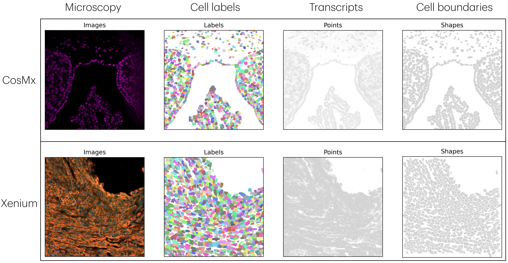

# Summary
Spatial transcriptomics has revolutionised transcriptomic analysis by preserving tissue architecture, enabling researchers to study gene expression within its spatial context. However, despite its potential, ST still faces significant technical challenges: the integration of raw data into a consistent and reproducible analysis workflows, and the accurate assignment of transcripts to individual cells. To address these challenges, we present MOSAIC, the first fully integrated, end-to-end workflow that supports raw data from both CosMx and Xenium platforms. MOSAIC unifies transcriptomic and imaging data into a single Python object based on the spatialdata format. This unified structure ensures compatibility with a broad range of Python tools, enabling robust quality control and downstream analyses. With MOSAIC, users can perform advanced analyses such as resegmentation (to more accurately assign transcripts to individual cells), cell typing, tissue domain identification, and cell-cell communication within a seamless and reproducible Python environment.

# Statement of need
Spatial transcriptomics (ST) enables the study of transcriptomes within intact tissues, which is essential for understanding a cell’s position relative to its neighbours and the surrounding extracellular structures. This spatial context provides crucial insights into cellular phenotype, function, and disease progression, particularly in cancer, where the tumour microenvironment (TME) influences processes such as chemoresistance [@mehraj_tumor_2021]. The commercialisation of ST platforms has expanded access to these technologies, earning ST the title of “Method of the Year 2020” by Nature Methods [@marx_method_2021].

Imaging-based fluorescence in situ hybridisation (FISH) technologies provide high-multiplex, subcellular-resolution transcriptomic data across over one million cells. These platforms, such as CosMx by NanoString and Xenium by 10x Genomics, offer high sensitivity and specificity, facilitating the exploration of cell atlases, cell–cell interactions, and the phenotypic architecture of the TME [@chen_spatially_2015, @vandereyken_methods_2023].

Despite the promise of spatial transcriptomics, significant technical challenges remain. Two primary challenges include: (1) the integration of raw spatial transcriptomic data into standardised and reproducible analysis workflows, which is complicated by variability in platforms and data formats; and (2) the accurate assignment of transcripts to individual cells, a task complicated by the heterogeneity and complex architecture of tissues. These challenges hinder downstream analyses such as cell type identification, spatial gene expression mapping, and inference of cell-cell interactions. Addressing these challenges is critical for fully harnessing the potential of spatial transcriptomics. At King’s College London, the [Spatial Biology Facility](https://www.kcl.ac.uk/research/facilities/the-spatial-biology-facility) utilises both CosMx (NanoString) and Xenium (10x Genomics) technologies. However, a unified workflow that accommodates both platforms, from raw data processing to downstream analysis, is still needed. Establishing such a framework will streamline cross-platform data integration, unlock the full potential of spatial biology, and enable more effective multimodal analysis.

To address the first challenge, we have developed a unified workflow that supports both CosMx and Xenium data. While Xenium data align relatively well, CosMx data lacked robust tooling, which we have now integrated into a seamless pipeline. We developed this workflow using the most suitable Python package, the spatialData library [@Marconato2025], which integrates spatial elements (images, transcript locations, cell segmentation labels) with transcriptomic data into an annotated dataframe for single-cell analysis.

Addressing the second challenge requires precise spatial delineation of cells, making cell segmentation a critical step. Segmentation quality directly impacts the accuracy of all downstream analyses. Our workflow integrates native segmentation approaches: CosMx uses a Cellpose-based method [@Stringer2021], and Xenium applies a Voronoi expansion strategy. Users can also opt for alternative or custom segmentation tools, which may offer better performance but require careful parameter tuning often difficult to implement in tools like Xenium Ranger (10x Genomics) or AtoMx (NanoString).

This integrated pipeline provides a foundation for downstream modeling and analysis, offering a scalable solution for tackling key challenges in spatial transcriptomics, especially in multimodal data integration.

# Overview of the workflow
The MOSAIC workflow ([https://github.com/anthbapt/MOSAIC](https://github.com/anthbapt/MOSAIC/tree/main)) supports both CosMx and Xenium spatial transcriptomics platforms through modular pipelines designed for data integration, visualisation, and analysis (Fig. 1). For CosMx, data are first exported from the AtoMx platform, including all Flat Files and relevant Raw Files such as Morphology2D. These files are uncompressed and organised using helper scripts to generate structured directories (e.g., CellComposite, CellLabels) essential for downstream processing.

Structured inputs are then read into the analysis pipeline using a custom reader, which extends the spatialdata_io framework to incorporate various image types along with cell shape annotations (polygons). The resulting .zarr object is processed using Python-based tools such as squidpy and spatialdata for quality control and downstream analyses, including resegmentation, cell typing, niche identification, or cell-cell communication. An associated GitHub repository documents the workflow and lists compatible Python tools that support the spatialdata object format.

CosMx data can also be visualised using Napari with the CosMx plugin, enabling interactive quality control of segmentations, marker expressions, and transcript distributions.

Xenium data follow a similar pipeline. Data are exported directly from the instrument, processed through the same reader, and converted into a .zarr object. This unified format is then analysed using the same set of Python tools, ensuring consistency across platforms.

---

<figure>
  
  <figcaption>Figure 1: The MOSAIC workflow is associated with two visualisation strategies: On one hand, Napari with the CosMx plugin to visualise CosMx data; on the other hand, Xenium Explorer for Xenium data. MOSAIC takes the raw data and converts it into a Python object, making it easy to perform quality control and facilitate downstream analysis.</figcaption>
</figure>

---

MOSAIC is the first fully integrated end-to-end workflow that supports both CosMx and Xenium raw data, standardising their output into a unified spatial data format (Fig. 2). The entire process is thoroughly documented in the GitHub repository, which includes two example workflows: one using a publicly available CosMx dataset from the NanoString website, and another using a Xenium dataset from the 10x Genomics platform.

---

<figure>
  
  <figcaption>Figure 2: The Python SpatialData object obtained after using the MOSAIC workflow embeds both CosMx and Xenium data into similar objects, which can be combined or compared. MOSAIC, along with the Python library spatialdata, allows for the visualisation and connection of SpatialElements: Images (e.g., H&E or immunofluorescence stains), Labels (segmentation maps), Points (i.e., transcripts), and Shapes (e.g., cell/nucleus boundaries or ROIs). Both CosMx and Xenium data are sourced from public repositories (see the Data Availability section). </figcaption>
</figure>

---

Finally, we have created a GitHub repository ([https://github.com/anthbapt/Spatial-Biology-Tools](https://github.com/anthbapt/Spatial-Biology-Tools/tree/main)) that compiles a collection of Python tools designed to be used alongside or after integration with our workflow. These tools support a wide range of applications, including segmentation, cell typing, domain identification, gene imputation, detection of spatially variable genes, cell-cell communication analysis, dimensionality reduction, multimodal integration, and the use of foundation models, among others. By providing this curated collection, our goal is to guide users seamlessly from raw data to advanced analytical applications, all within a unified and community-supported framework.

# Data availaility
The datasets used to generate the figures are publicly available at the following websites: [https://nanostring.com/ffpe-dataset/cosmx-smi-mouse-brain-ffpe-dataset/](https://nanostring.com/products/cosmx-spatial-molecular-imager/ffpe-dataset/cosmx-smi-mouse-brain-ffpe-dataset/) and [https://www.10xgenomics.com/datasets/xenium-prime-ffpe-human-skin](https://www.10xgenomics.com/datasets/xenium-prime-ffpe-human-skin). The processed datasets associated with the code are provided in a Zotoro repository [https://zenodo.org/uploads/15365593](https://zenodo.org/uploads/15365593) as a real-world data example.

# Code availaility
The MOSAIC workflow is publicly available on GitHub at [https://github.com/anthbapt/MOSAIC](https://github.com/anthbapt/MOSAIC/tree/main).

# Related software
This work integrates nicely with the existing spatial transcriptomics community, particularly the tools that are part of the [scverse ecosystem](https://scverse.org). 

# Planned Enhancements
Recognising that spatial transcriptomics is a rapidly evolving field, MOSAIC is designed to remain aligned with the latest standards, both in terms of experimental setup and raw data processing, as well as on the computational side by integrating emerging methods and developmental tools. As part of the King's College London Spatial Biology Facility (SBF), MOSAIC must stay up to date to help the SBF fulfill its mission.

Furthermore, newly developed tools within the group will be directly integrated into MOSAIC. This will provide the broader community with the ability to use both their own methods and those developed by our team, methods that have been tested across a wide range of tissue types and technologies, thanks to the strong network surrounding the facility.

The tools that will be natively integrated into MOSAIC include segmentation methods based on SAM, as well as a multimodal integration approach that combines transcriptomic and spatial information to generate a more robust latent representation. The current modalities under consideration include H&E, Akoya PhenoCycler, IMC, and metallomics data.

# Acknowledgements
Anthony Baptista acknowledges support from the CRUK City of London Centre Award CTRQQR-2021100004.

# References
