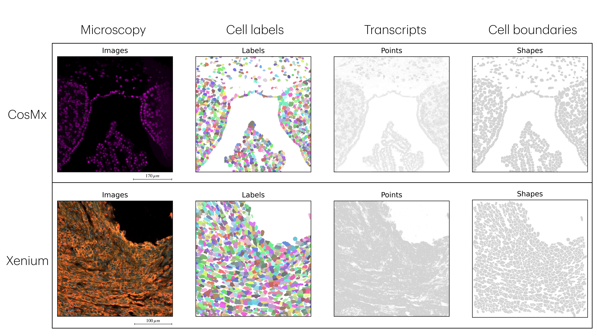

# Summary

# Statement of need
Spatial transcriptomics (ST) has revolutionized transcriptomic analysis by preserving tissue architecture, enabling researchers to study gene expression within its spatial context. Understanding a cell’s position relative to its neighbors and extracellular structures provides crucial insights into cellular phenotype, function, and disease progression—particularly in cancer, where the tumor microenvironment (TME) influences key processes such as chemoresistance [@mehraj_tumor_2021]. The commercialization of ST platforms has broadened access to these technologies, earning ST the title of *“Method of the Year 2020”* by *Nature Methods* [@marx_method_2021].

Imaging-based fluorescence in situ hybridization (FISH) technologies provide high-multiplex, subcellular-resolution transcriptomic data across over one million cells. These platforms, such as CosMx by NanoString and Xenium by 10x Genomics, offer high sensitivity and specificity, facilitating the exploration of cell atlases, cell–cell interactions, and the phenotypic architecture of the TME [@chen_spatially_2015, @vandereyken_methods_2023].

Despite the promise of spatial transcriptomics, significant technical challenges remain. Two primary issues include: (1) the integration of raw data into coherent analysis workflows, and (2) the accurate association of transcripts with individual cells. At King’s College London, the [Spatial Biology Facility](https://www.kcl.ac.uk/research/facilities/the-spatial-biology-facility) utilises both CosMx (NanoString) and Xenium (10x Genomics) technologies. However, a unified workflow that accommodates both platforms—from raw data processing to downstream analysis—is still needed. Establishing such a framework will streamline cross-platform data integration, unlock the full potential of spatial biology, and enable more effective multimodal analysis.

To address the first challenge, we have developed a unified workflow that supports both CosMx and Xenium data. While Xenium data align relatively well, CosMx data lacked robust tooling, which we have now integrated into a seamless and consistent pipeline. Moreover, we developped this workflow by using the most suitable Python package spatialData library [@Marconato2025], which provide a suitable object to integrate both the spatial elements (images, space location of transcripts, cell segmentaton labels, cell segmentation polygons) and transcriptomics information, which is an annotated datframe which defines single-cell transcriptomics.

Addressing the second challenge requires precise spatial delineation of cells—making cell segmentation a critical first step. Segmentation quality directly impacts the accuracy of all downstream analyses. Our current workflow integrates native segmentation approaches: CosMx uses a Cellpose-based method [@Stringer2021], and Xenium applies a Voronoi expansion strategy. However, users can also opt for alternative or custom segmentation tools, which may offer better performance but require careful parameter tuning—often difficult to implement in tools like Xenium Ranger (10x Genomics) or AtoMx (NanoString).

This integrated and consistent pipeline provides a foundation for downstream modeling and analytical functions, and it offers a scalable solution for tackling key challenges in spatial transcriptomics—particularly in the context of multimodal data integration.

# Overview of the workflow

- [Napari v0.4.17](https://github.com/napari/napari/releases/tag/v0.4.17) + CosMx plugin (`napari/napari_CosMx-0.4.17.3-py3-none-any.whl`)
- CosMx/Xenium conda environment (`env/cosmx.yml`)
- CosMx/Xenium Reader (`src/reader/`)
- CosMx/Xenium QC scripts (`src/qc/`)
- CosMx/Xenium resegmentation scripts (`src/segmentation/`)
- CosMx Cell composition code (`src/composition/`)
- CosMx/Xenium analysis codes (`src/analysis/`)

# Related software

This work integrates nicely with the existing spatial transcriptomics community, particularly the tools that are part of the scverse ecosystem. To this end, we have created a GitHub repository ([Spatial-Biology-Tools](https://github.com/anthbapt/Spatial-Biology-Tools/tree/main) where we collect Python tools that may be useful after using or integrating with our workflow. Our integration workflow ultimately aims to take users from raw data to specific applications seamlessly, leveraging a unified framework defined by the community.

# Planned Enhancements
include cell typing benchmark, segmentation benchmark and a new method based on foundation models (micro-SAM, cellSAM), cell-cell communication analysis, seamless multi-modal integration with H&E, Akoya PhenoCycler, IMC.

# Acknowledgements
Anthony Baptista acknowledges support from the CRUK City of London Centre Award CTRQQR-2021100004.

# References
